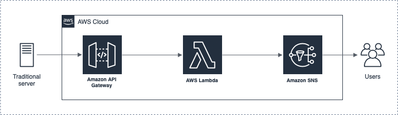

# smart-garage-notifications-aws

This project contains source code and supporting files for a serverless application that sends warning notifications to house residents about the garage door being opened for a long period of time. The [smart-garage-backend](https://github.com/husain3/smart-garage-backend) server sends requests to API Gateway, which then are processed by AWS Lambda and finally transfered to SNS to send warning text messages. You can deploy this serverless application with the SAM CLI or deploy a CI/CD pipeline to AWS Pipeline to automate the process. It includes the following files and folders:

```
smart-garage-notifications
|---send_garage_alert
|   └---app.py                          - Code for the task's ML procedure
|   └---requirements.txt                - Pip requirements installed during container build.
|---pipeline
|   └---pipeline.yaml                   - CI/CD pipeline
|---README.md                           - This README file
|---buildspec.yaml                      - Buildspec used in AWS codebuild
└---template.yaml                       - Template that defines the AWS resources.
```

The application uses several AWS resources, including Lambda functions, API Gateway API, and SNS. These resources are defined in the `template.yaml` file in this project. You can update the template to add AWS resources through the same deployment process that updates your application code. 

Here is a diagram of the used AWS services:




To build and deploy your application without the CI/CD pipeline, run the following:

```bash
sam build --use-container
sam deploy --guided
```

To use a CI/CD pipeline to build and deploy your application, run the following:

```bash
aws cloudformation create-stack --stack-name smart-garage-notifications-pipeline --template-body file://pipeline.yaml --capabilities CAPABILITY_NAMED_IAM
```

